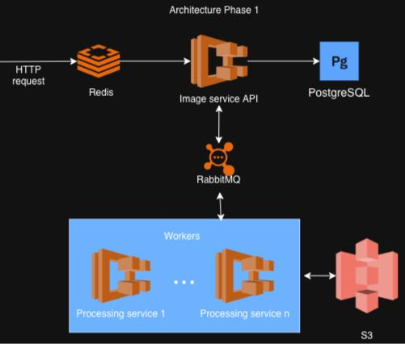

# Image Flow

REST API for uploading and serving images. Designed for scalability.

## Features

- **Image Upload:** Upload images directly to MinIO (S3-compatible storage) with optional dimensions (width/height).
- **Asynchronous Processing:** Event-driven resizing triggered via **RabbitMQ** message queue.
- **Scalability:** Horizontal scaling of processing workers on dockercompose. Autoscalling of workers depending on rabbitMQ workers depending on queue depth implemented curently on local kubetnetes.
- **Caching:** Redis-backed caching for image listing endpoint (first 2 pages) to reduce DB queries on the image service.
- **Hexagonal Architecture:** Decoupled business logic from infrastructure.
- **Janitor Job:** Automated cleanup of stuck processing tasks.
- **Swagger Documentation:** Interactive API documentation.

## Tech Stack

- **Framework:** [NestJS](https://nestjs.com/)
- **Database:** PostgreSQL with TypeORM
- **Message Queue:** RabbitMQ
- **Cache:** Redis
- **Storage:** MinIO (Object Storage)
- **Image Processing:** [sharp](https://sharp.pixelplumbing.com/)
- **Dependency Management:** Monorepo using npm workspaces.

## Architecture

The project follows **Hexagonal Architecture** (Ports & Adapters):



- **Domain:** Pure business entities (e.g., `Image`).
- **Application:** Use cases and port interfaces (e.g., `ImageService`, `ImageRepository` port).
- **Infrastructure:** Framework-specific implementations (e.g., `TypeOrmImageRepository`, `ImageController`, `RabbitMqPublisher`).

Detailed architectural documentation:
- [RabbitMQ Implementation & Planning](services/docs/RabbitMQ.md)
- [Next Phases Planning](services/docs/Next_Phases.md)

## Business Requirement Assumptions

- Accepted image formats are: `['jpg', 'jpeg', 'png', 'webp']`.
- On `GET /images`, one page has 10 entries by default, but this can be adjusted as needed.
- On `GET /images`, the first 2 pages are cached for 60s to reduce DB queries (further caching strategies will be decided in next [phases](/services/docs/Next_Phases.md) depending on system usage).
- The system does not use throttling on `POST` requests yet, but it is prepared to do so based on request IP addresses, which are used in request logs.
- Hexagonal architecture was used to simplify planned Kubernetes deployment in the next [phases](/services/docs/Next_Phases.md) and further development.
- In the current POC state, Docker Compose can be used with `--scale processor-service=N` to set the number of workers in the environment. Dynamic scaling of resources based on traffic will be handled in the next [phases](/services/docs/Next_Phases.md).
- Original images are not removed after being processed. A job to remove images older than 7 days can be easily added.
- Images are set to be public in MinIO; they are planned to be cached with a CDN in the next [phases](/services/docs/Next_Phases.md).
- The app is initially prepared for development with tests in the pipeline supporting a TDD approach.

## Services

- `image-service`: API for uploads and metadata management (External port 3000).
- `processor-service`: Worker for image processing (Scalable via `--scale processor-service=N`).
- `common`: Shared code and utilities used by all services.

## Tests

- The project uses unit, integration, e2e, and architectural tests.
  - `jest`: Covers most exceptions handled by the apps.
  - `dependency-cruiser`: Used to enforce hexagonal architecture rules.
- Tests are run in the pipeline with test workflows for each service in the `apps` folder, covering unit and architectural tests.

## Getting Started

### Prerequisites

- Docker and Docker Compose

### Running the System

## Docker Compose

1. Clone the repository.
2. Run `docker compose up --build` from the root directory. You can use `--scale processor-service=N` to utilize more workers.
3. The API will be available at `http://localhost:3000` (mapped to internal port 3005).
4. Swagger UI: `http://localhost:3000/api`.

## Local Kubernetes
   ```
   bash scripts/k8s/deploy-local.sh
   ```
   test keda scalling with script 
   ```
   bash scripts/test-scaling.sh
   ```

### Testing the flow

1. **Upload an image with dimensions:**
   ```bash
   curl -X POST http://localhost:3000/images \
     -F "file=@./your-image.jpg" \
     -F "title=My Image" \
     -F "width=200" \
     -F "height=200"
   ```
2. **Check status:**
   The `processor-service` workers will pick up the task from RabbitMQ. You can check the status via:
   ```bash
   curl http://localhost:3000/images
   ```
   _Note: The first two pages of results are cached for 60 seconds._
3. **Test public images by downloading them from DB records.**
4. **View images via MinIO UI:**
   ```
   Access panel: http://localhost:9001
   Login: `minioadmin`
   Password: `minioadmin`
   ```
5. **View RabbitMQ queue with:**
   ```
   http://localhost:15672
   Login: `guest`
   Password: `guest`
   ```
